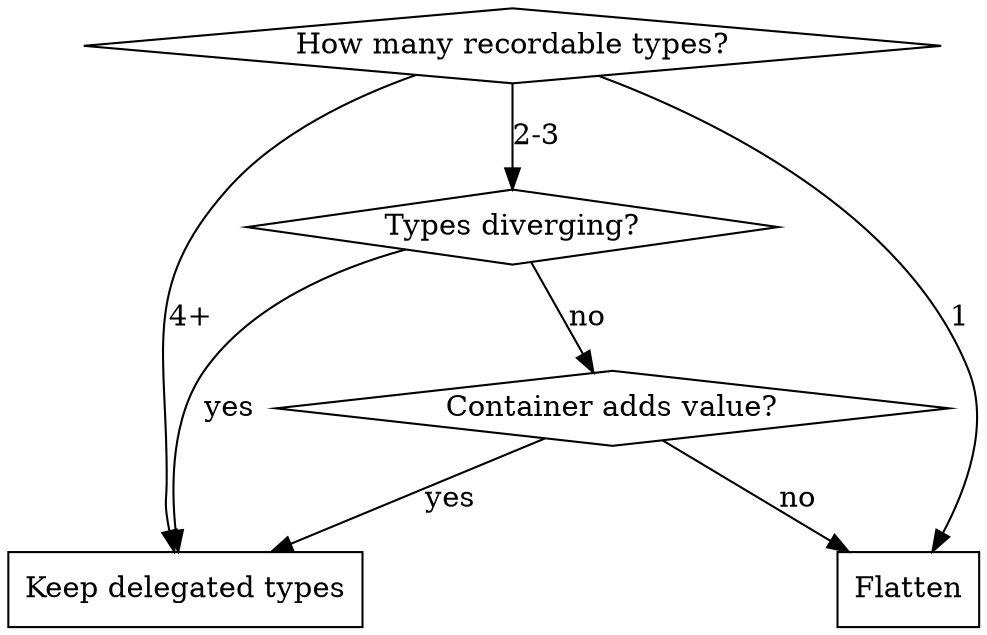

# Flattening Delegated Types

When the abstraction no longer pays for itself, remove it.

## When to Flatten

**Flatten when:**
- Only 1-2 recordable types remain
- Types are similar enough to merge
- Container adds complexity without value
- Queries get simpler without indirection

**Signals to flatten:**
- "This container just wraps one type"
- "These types could share a table with a type column"
- "The indirection makes code harder to follow"

## Real Example: Fizzy PR 445

Fizzy had a `Message` container with delegated types to `Comment` and `EventSummary`. It was flattened to just `Comments`.

**Why flattened:**
- Only 2 types (Comment, EventSummary)
- EventSummary was conceptually "system-generated Comment"
- Container added complexity without enough benefit

### Before (with delegated types)

```ruby
class Message < ApplicationRecord
  delegated_type :messageable, types: %w[Comment EventSummary]
  belongs_to :card
end

class Comment < ApplicationRecord
  include Messageable  # has_one :message, has_one :card through: :message
end

class EventSummary < ApplicationRecord
  include Messageable
  has_many :events
end

# Usage
@card.capture Comment.new(comment_params)
@card.messages.chronologically  # unified timeline
```

### After (flattened)

```ruby
class Comment < ApplicationRecord
  belongs_to :card
  belongs_to :creator, class_name: "User"

  scope :by_system, -> { joins(:creator).where(creator: { role: :system }) }
  scope :by_user, -> { joins(:creator).where.not(creator: { role: :system }) }
  scope :chronologically, -> { order(created_at: :asc) }
end

# Usage
@card.comments.create!(comment_params)
@card.comments.chronologically  # same unified timeline, simpler
```

### What Changed

| Aspect | Before | After |
|--------|--------|-------|
| Tables | messages, comments, event_summaries | comments |
| Models | 3 | 1 |
| Indirection | Message → Messageable | Direct |
| System comments | EventSummary type | `creator.role == :system` |
| Query | `card.messages` | `card.comments` |

### Migration

```ruby
class FlattenMessagesAndComments < ActiveRecord::Migration[8.1]
  def change
    add_reference :comments, :card, null: true

    execute <<~SQL
      UPDATE comments
      SET card_id = (
        SELECT messages.card_id
        FROM messages
        WHERE messages.messageable_type = 'Comment'
          AND messages.messageable_id = comments.id
        LIMIT 1
      )
    SQL

    change_column_null :comments, :card_id, false
    drop_table :messages
  end
end
```

## Decision Framework



## Common Flattening Patterns

### Pattern 1: Merge similar types

EventSummary → system-generated Comment (distinguished by creator role)

### Pattern 2: Use STI instead

If types share most fields but differ in behavior:

```ruby
class TimelineEntry < ApplicationRecord
  # STI with type column
end

class Comment < TimelineEntry
end

class SystemEvent < TimelineEntry
end
```

### Pattern 3: Direct association

If only one recordable type remains:

```ruby
# Before: Card → Recording → Comment
# After: Card → Comment (direct)

class Card < ApplicationRecord
  has_many :comments, dependent: :destroy
end
```

## Red Flags: Don't Flatten

**Keep delegated types if:**
- Types are genuinely different (different fields, different behavior)
- You expect more types to be added
- Container provides real value (access control, unified operations)
- Flattening would create a wide table with many nullable columns
